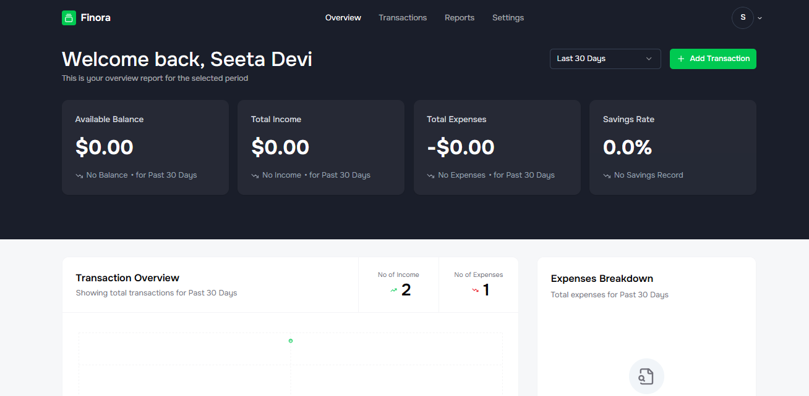
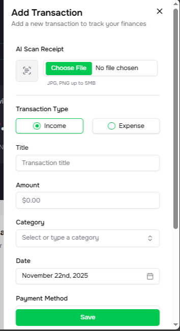
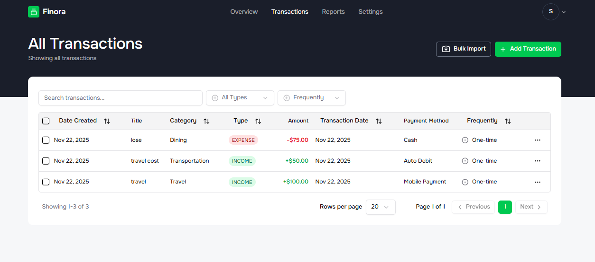

<h1 align="center">🌟 Advanced MERN AI Finance SaaS Platform</h1>

<p align="center">
A modern, full-featured, AI-powered Finance Management SaaS built with <b>MERN + TypeScript</b>.
<br/>
Featuring AI Receipt Scanning, Analytics, Recurring Transactions, CSV Import, Monthly Reports & more.
</p>

---

## 🔥 Tech Stack Badges

<p align="center">
  
  
  
  
  
  
</p>

---

# 👨‍💻 Author

**Magraj Jakhar**  
B.Tech – Computer Science & Engineering  
Indian Institute of Information Technology, Una  

📞 +91-8302596591  
📧 jakharmagraj71@gmail.com  
🔗 LinkedIn: https://www.linkedin.com/in/magraj-jakhar-1a192b291  
🔗 GitHub: https://github.com/Magraj71  
🔗 LeetCode: https://leetcode.com/u/Magraj_Jakhar/  
🔗 Portfolio: https://portfolio-sandy-alpha-70.vercel.app/

---

# 🚀 Features

### 🔐 Authentication  
- Secure JWT-based Auth  
- Login & Registration  
- Protected Routes  

### 💸 Transactions  
- Add, Edit, Delete transactions  
- AI-powered Receipt OCR (Auto-Fill)  
- Search, Filter & Pagination  
- CSV Import  
- Duplicate & Bulk Delete  

### 📊 Analytics  
- Expense Breakdown Pie Chart  
- Income vs Expense Line Chart  
- Monthly Overview  
- Aggregated MongoDB Insights  

### 🔁 Automations  
- Recurring Transactions (Cron Jobs)  
- Monthly Email Reports  

### 👤 User Profile  
- Cloudinary Profile Image Upload  
- Edit User Details  

### 🧩 SaaS Architecture  
- Stripe-ready structure  
- TypeScript codebase  
- Production-level Backend APIs  

---

# 📸 Screenshots

### 🏠 Dashboard


### ➕ Add Transaction


### 📄 All Transactions


---

# 📦 Installation

### Clone the Repository  
```bash
git clone https://github.com/Magraj71/Ai-financial-saas-platform
cd Ai-financial-saas-platform
